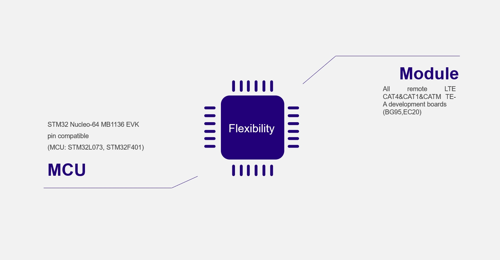
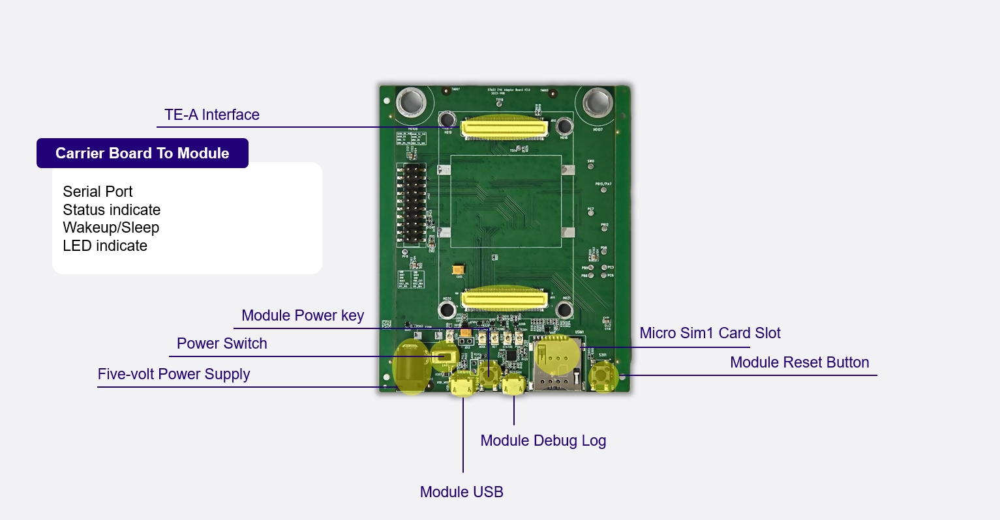
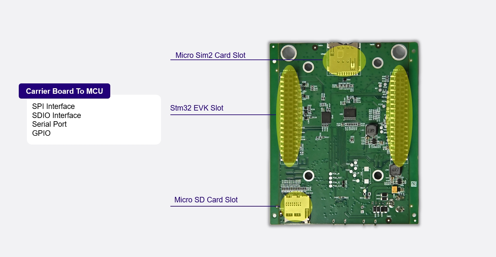
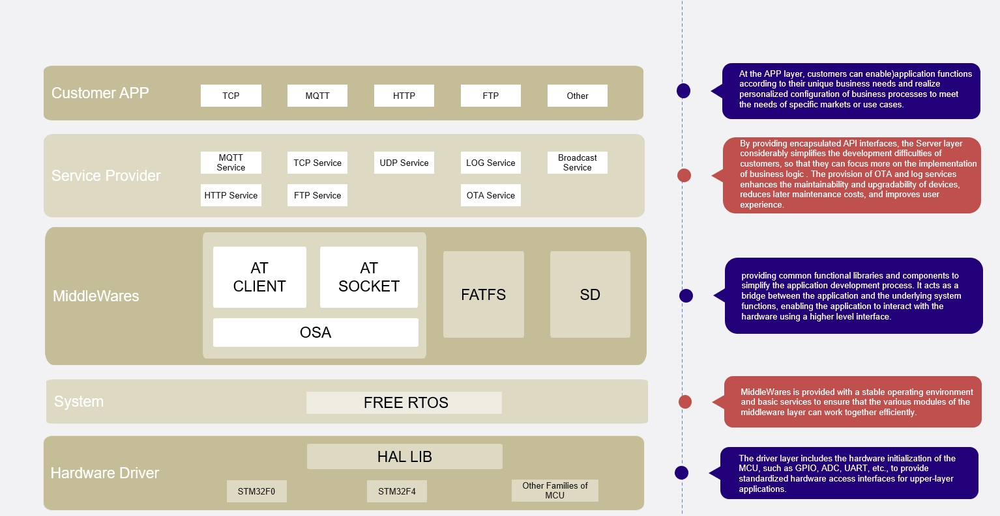
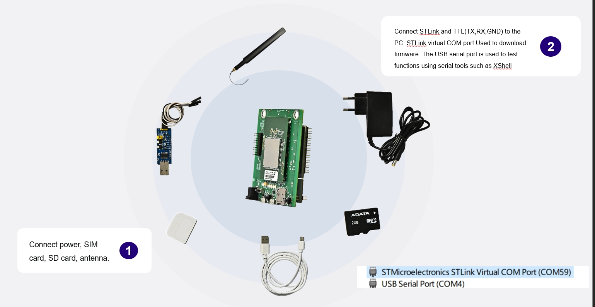

# Quectel-User-Friendly-Development
Quectel module products are powerful,However,not all user are familiar with the use of AT commands. So,we have meticulously developed a comprehensive SDK that encapsulates complex AT commands. Our vision is to simplify the interaction between user and the module through this SDK,without needing in-depth knowledge of the underlying AT commands

# Hardware and Tools Preparation

# Hardware and Tools

# Hardware and Tools Preparation

# Software Tools 
Code compilation: Download STM32CubeIDE from ST website:
https://www.st.com/content/st_com/zh/stm32cubeide.html
Firmware download :STM32 official recommended free tool STM32CubeProgrammer
https://www.st.com/zh/development-tools/stm32cubeprog.html

# Overview of The Five-Layer Structure

# Test Environment Preparation

# TEST VIDEO
<video width="1920" height="1080" controls>
  <source src="./document/img/7.mp4" type="video/mp4">
  <source src="./document/img/7.ogg" type="video/ogg">
  Your browser does not support the video tag.
</video>